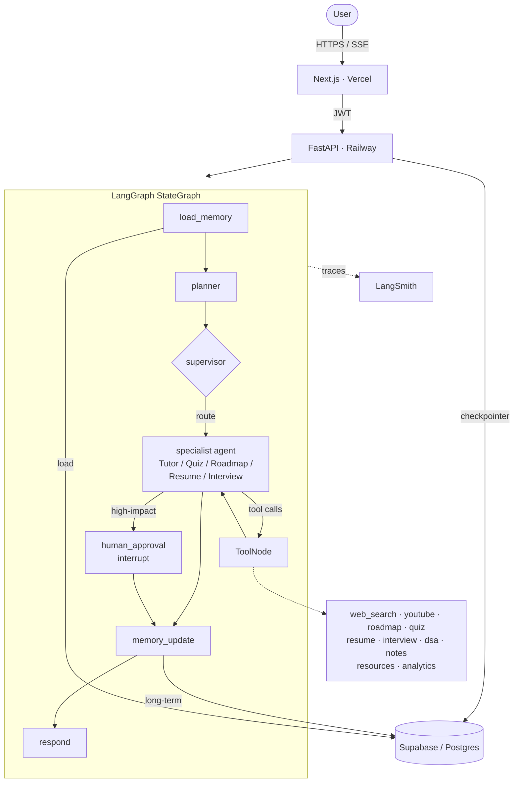
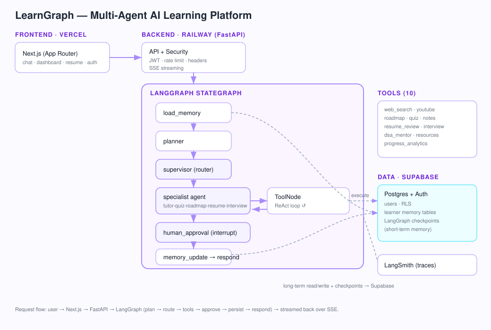

# 🧠 LearnGraph — Multi-Agent AI Learning Platform

> Built a multi-agent AI learning platform using **GPT-5, LangGraph, FastAPI, Next.js, Supabase, and Railway**. Implemented tool-using autonomous agents, long-term memory, personalized learning workflows, progress analytics, and multi-agent orchestration.


LearnGraph is a **production-grade agentic platform** — not a prompt-response chatbot. A **LangGraph `StateGraph`** routes every request through a **supervisor that delegates to specialized agents** (Tutor, Quiz, Roadmap, Resume, Interview). Each agent is a ReAct loop backed by real tools, short- and long-term memory, streaming responses, human-in-the-loop checkpoints, and LangSmith observability.

---

## ✨ Highlights (resume-worthy)

| Capability | How it's implemented |
|---|---|
| **Multi-agent orchestration** | Supervisor node routes to specialist agents via conditional edges (`backend/app/agents/graph.py`) |
| **ReAct tool-using agents** | Reason → decide → call tool → analyze → respond loop with a shared `ToolNode` |
| **Model-agnostic** | Swap GPT-5 / Claude / Gemini / DeepSeek via `backend/app/agents/models.yaml` |
| **Long-term memory** | Learner profile, goals, quiz history, roadmap progress in Supabase/Postgres |
| **Short-term memory** | LangGraph Postgres checkpointer — workflows resume without losing state |
| **Streaming** | Token-by-token Server-Sent Events from FastAPI → Next.js |
| **Human-in-the-loop** | `interrupt()` checkpoints with Approve/Reject for high-impact actions |
| **Knowledge-aware (RAG)** | Tutor/Interview agents retrieve from a curated KB (pgvector) and cite sources |
| **Observability & cost** | LangSmith traces + usage/cost analytics in an admin dashboard |
| **Observability** | LangSmith tracing through environment config |
| **Resume analysis** | PDF upload → text extraction → ATS scoring, skill gap, bullet rewrites |
| **Auth & security** | Supabase JWT, RLS, rate limiting, secure headers, input validation |
| **CI/CD** | GitHub Actions: lint, type-check, tests (70% gate), build |
| **Gamification** | XP, streaks, topic completion, quiz history, analytics dashboard |

---

## 🏗️ Architecture



Full design write-up: [`docs/ARCHITECTURE.md`](docs/ARCHITECTURE.md).



---

## 📚 Documentation

| Doc | What's inside |
|---|---|
| [`docs/ARCHITECTURE.md`](docs/ARCHITECTURE.md) | System design, graph, memory, API, deployment |
| [`docs/DECISIONS.md`](docs/DECISIONS.md) | ADRs: why GPT-5 / LangGraph / FastAPI / Supabase / Railway / Vercel |
| [`docs/SCALING.md`](docs/SCALING.md) | Current vs. future architecture; Redis, Celery, Kafka, K8s, vector DBs |
| [`docs/INTERVIEW_GUIDE.md`](docs/INTERVIEW_GUIDE.md) | Talking track + resume bullets (short/medium/advanced) |
| [`docs/INTERVIEW_QUESTIONS.md`](docs/INTERVIEW_QUESTIONS.md) | 50 Q&A across LangGraph, FastAPI, agents, system design, DBs, security, deploy, CI/CD |
| [`docs/FINAL_AUDIT.md`](docs/FINAL_AUDIT.md) | Honest production-readiness audit with per-section 1–10 scores |
| [`docs/DEPLOYMENT_AUDIT.md`](docs/DEPLOYMENT_AUDIT.md) | Deploy-tomorrow checklist: env vars, Railway, Vercel, Supabase, build, deps, CI |
| [`docs/RECRUITER_ASSESSMENT.md`](docs/RECRUITER_ASSESSMENT.md) | Recruiter-facing strengths/weaknesses + internship scores |
| [`docs/RAG.md`](docs/RAG.md) | Knowledge-aware agent: embeddings, vector store, retriever, grounding |
| [`docs/OBSERVABILITY.md`](docs/OBSERVABILITY.md) | LangSmith tracing, usage monitoring, cost analytics, admin dashboard |
| [`docs/DEPLOYMENT_VERIFICATION.md`](docs/DEPLOYMENT_VERIFICATION.md) | Step-by-step deploy runbook with acceptance criteria |

---

## 🤖 The agents & tools

| Agent | Tools it can call |
|---|---|
| **Tutor** | knowledge_search (RAG), web_search, youtube_learning, notes_generator, resource_recommender, dsa_mentor |
| **Quiz** | quiz_generator, progress_analytics |
| **Roadmap** | roadmap_generator, resource_recommender, progress_analytics |
| **Resume** | resume_review, knowledge_search (RAG), web_search |
| **Interview** | interview_prep, knowledge_search (RAG), dsa_mentor, web_search |

All 10 tools degrade gracefully when optional API keys (Tavily, YouTube) are absent.

---

## 🖼️ Screens

The app ships these pages (add screenshots to `docs/` and reference them here):

- **Landing** — feature & agent showcase.
- **Auth** — Supabase email/password login & signup.
- **AI Mentor (`/chat`)** — streaming chat with live agent + tool indicators and HITL approval.
- **Dashboard (`/dashboard`)** — XP, streaks, mastery chart, weak areas, goals.
- **Resume (`/resume`)** — PDF upload with an animated ATS score and rewrite suggestions.

> _Tip: capture screenshots after `npm run dev` and drop them in `docs/screenshots/`._

---

## 📁 Repository layout

```text
simple-chatbot/
├── .github/workflows/      # CI: backend.yml, frontend.yml
├── backend/                # FastAPI + LangGraph multi-agent service
│   ├── app/
│   │   ├── agents/         # graph, supervisor, planner, specialists, model factory
│   │   ├── tools/          # 10 agent tools
│   │   ├── memory/         # checkpointer + long-term Supabase store
│   │   ├── services/       # PDF parsing
│   │   ├── api/            # routes: chat, auth, progress, resume
│   │   ├── security.py     # rate limiting, headers, env validation, errors
│   │   ├── config.py
│   │   └── main.py
│   ├── tests/              # pytest suite (graph, tools, memory, auth, security…)
│   ├── requirements.txt / requirements-dev.txt
│   ├── Dockerfile / railway.json / Procfile
│   └── .env.example
├── frontend/               # Next.js (App Router) + Tailwind
│   ├── app/                # landing, login, signup, dashboard, chat, resume
│   ├── components/ · lib/  # auth provider, guards, api/sse/format helpers
│   ├── tests/              # vitest
│   └── vercel.json · .env.local.example
├── supabase/schema.sql     # tables, RLS, triggers
└── docs/ARCHITECTURE.md
```

---

## 🚀 Quick start (local)

### Prerequisites
- Python 3.11+, Node.js 20+
- A Supabase project, an OpenAI API key (GPT-5). Optional: Tavily, YouTube, LangSmith.

### 1. Database
Run [`supabase/schema.sql`](supabase/schema.sql) in the Supabase SQL editor.

### 2. Backend
```bash
cd backend
python -m venv .venv && source .venv/bin/activate
pip install -r requirements-dev.txt
cp .env.example .env        # fill in keys
uvicorn app.main:app --reload --port 8000
```

### 3. Frontend
```bash
cd frontend
npm install
cp .env.local.example .env.local   # fill in keys
npm run dev                         # http://localhost:3000
```

---

## 🧪 Testing & quality

```bash
# Backend
cd backend
ruff check app tests && ruff format --check app tests
pytest --cov=app --cov-fail-under=70

# Frontend
cd frontend
npm run lint && npx tsc --noEmit && npm test
```

CI runs all of the above on every push and pull request (`.github/workflows/`).

---

## 🔒 Security

- JWT validation on every protected endpoint; LangGraph threads namespaced per user.
- Supabase Row-Level Security; the service-role key never reaches the browser.
- Per-IP sliding-window rate limiting (tighter budget for LLM/upload endpoints).
- Secure headers (HSTS, CSP, X-Frame-Options, …) on API and frontend.
- Input validation/sanitization on all request bodies.
- Global exception handler — no stack traces leak to clients.
- Startup env validation fails fast in production when critical config is missing.

---

## ☁️ Deployment

| Component | Platform | Config |
|---|---|---|
| Frontend | **Vercel** | `frontend/vercel.json` (Next.js) |
| Backend | **Railway** | `backend/Dockerfile` + `backend/railway.json` (`/health` check) |
| Database / Auth | **Supabase** | `supabase/schema.sql` |

Set the environment variables from `backend/.env.example` and
`frontend/.env.local.example` in each platform. For multi-instance backends, use
the Postgres checkpointer (set `DATABASE_URL`) so human-in-the-loop resume works
across workers.

---

## 🧭 Swapping the model

Edit `backend/app/agents/models.yaml` (or set `LEARNGRAPH_DEFAULT_MODEL`):

```yaml
default: gpt-5      # change to: claude | gemini | deepseek | gpt-5-mini
```

No code changes required — `init_chat_model` resolves the provider at runtime.

---

## 📄 License
MIT
